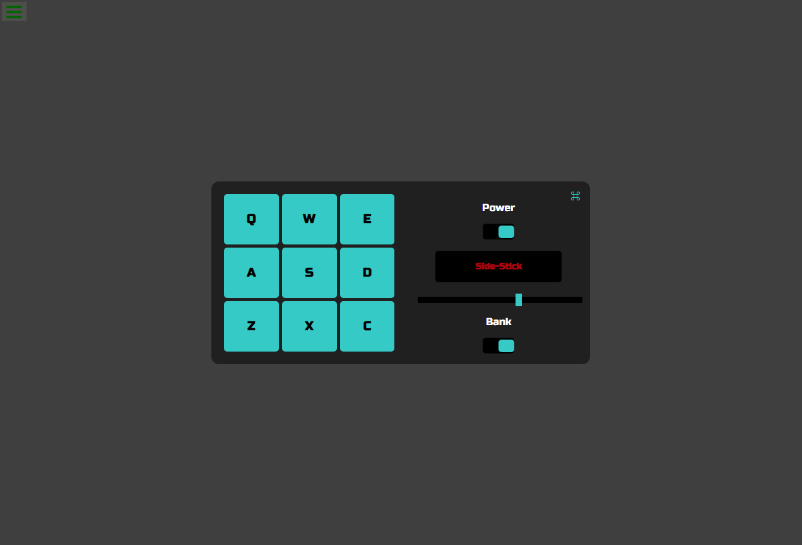
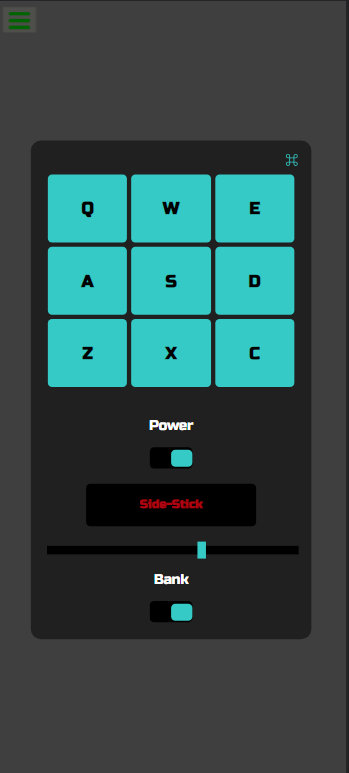

# Drum Machine
## Description
TThis project aims to build a drum machine with React.
#
## Project Requirements
1. I should be able to see an outer container with a corresponding id="drum-machine" that contains all other elements.
2. I should be able to see an outer container with a corresponding id="drum-machine" that contains all other elements.
3. Within #drum-machine I can see 9 clickable drum pad elements, each with a class name of drum-pad, a unique id that describes the audio clip the drum pad will be set up to trigger, and an inner text that corresponds to one of the following keys on the keyboard: Q, W, E, A, S, D, Z, X, C. The drum pads MUST be in this order.
4. Within each .drum-pad, there should be an HTML5 audio element which has a src attribute pointing to an audio clip, a class name of clip, and an id corresponding to the inner text of its parent .drum-pad (e.g. id="Q", id="W", id="E" etc.).
5. When I click on a .drum-pad element, the audio clip contained in its child audio element should be triggered.
6. When I press the trigger key associated with each .drum-pad, the audio clip contained in its child audio element should be triggered (e.g. pressing the Q key should trigger the drum pad which contains the string Q, pressing the W key should trigger the drum pad which contains the string W, etc.).
7. When a .drum-pad is triggered, a string describing the associated audio clip is displayed as the inner text of the #display element (each string must be unique).
#
## Technologies
To carry out this project the following tools, libraries and languages were used:
- JavaScript
- SASS
- React
- Redux
- Vitejs
- npm
#

#

#
## License

#
MIT
#
## Contacto

